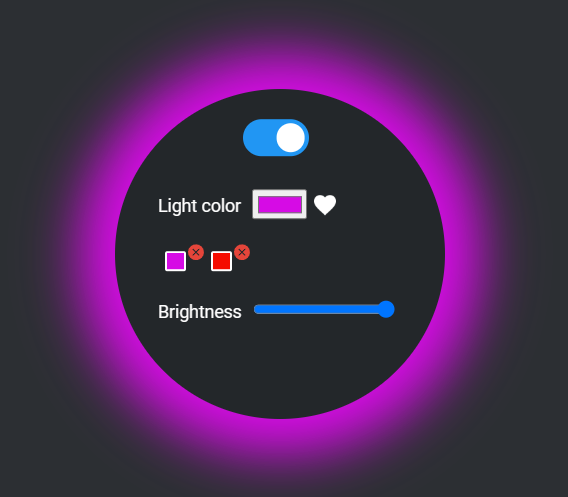

# Govee lights UI

Govee lights UI is a user-friendly web interface to control Govee lights.

Features:

- On/off control
- Color adjustment
- Brightness adjustment
- Save favorite colors



## Setup

Before getting started, make sure you have a Govee API key.  
To obtain your API key, please refer to the [Govee API documentation](https://developer.govee.com/docs/getting-started).

### Configuration

1. Navigate to the `src/config` folder.
2. Open `config.sample.json` and enter your device information (API key, MAC Address, device model).
3. Save the file and rename it to `config.json`.

### Start app
```
npm install
npm start
```

You can now access the UI at http://localhost:3000.

## Run as Windows service

To install the service, use the following command:
```
npm run service install
```

If you need to uninstall the service, use:
```
npm run service uninstall
```

**Recommended:** Set the service to automatically start with Windows.